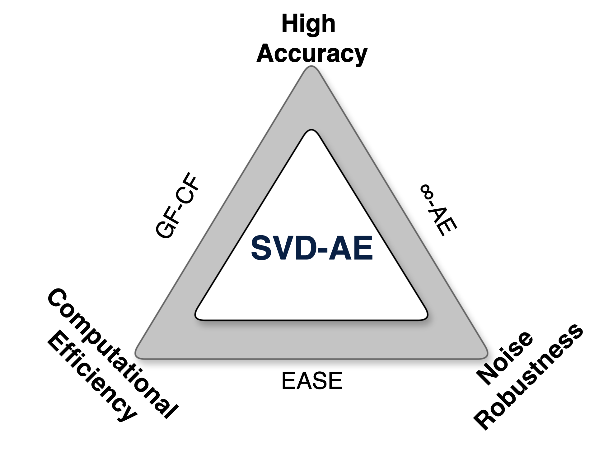
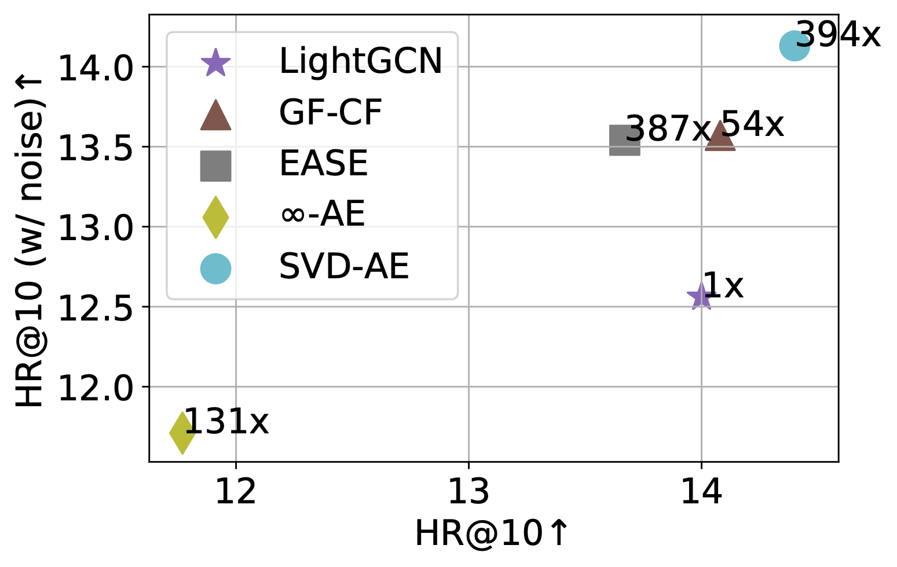

# SVD-AE: Simple Autoencoders for Collaborative Filtering


 [](https://arxiv.org/abs/2405.04746) [](https://hits.seeyoufarm.com)

[](https://paperswithcode.com/sota/recommendation-systems-on-gowalla?p=svd-ae-simple-autoencoders-for-collaborative)
[](https://paperswithcode.com/sota/collaborative-filtering-on-movielens-10m?p=svd-ae-simple-autoencoders-for-collaborative)
[](https://paperswithcode.com/sota/collaborative-filtering-on-movielens-1m?p=svd-ae-simple-autoencoders-for-collaborative)
[](https://paperswithcode.com/sota/recommendation-systems-on-yelp2018?p=svd-ae-simple-autoencoders-for-collaborative)


This repository contains the official implementation of [SVD-AE](https://arxiv.org/abs/2405.04746), a novel approach to collaborative filtering introduced in our IJCAI 2024 paper. 

- 📌 **Check out [our poster](https://www.dropbox.com/scl/fi/mm5obivc6hss0jgy0vdsl/SVD_AE_IJCAI_Poster.pdf?rlkey=mqkfnb5rc4fa1eee46w7q4h3l&st=ht28tyaw&dl=0) for a visual overview of SVD-AE!**

- 🧵 **For a detailed explanation, see [our Twitter/X thread](https://x.com/jeongwhan_choi/status/1821010085713465694) highlighting key aspects of SVD-AE.**

- 🎞️ **[Our presentation slides](https://www.dropbox.com/scl/fi/okdrh2htm4czcfb6cuhbo/SVD_AE_Talk.pdf?rlkey=1c60s0styu9e9u1rdzq9oqtln&st=v4wkydsz&dl=0) provide a comprehensive look at the method and results.**


The best overall balance between 3 goals |  The accuracy, robustness, and computation time of various methods on Gowalla |
:-------------------------:|:-------------------------:
 |  |

- Key Features of **SVD-AE**:
    - Closed-form solution for efficient computation
    - Low-rank inductive bias for noise robustness
    - Competitive performance across various datasets

---

## Installation
To set up the environment for running SVD-AE, follow these steps:

1. Clone this repository:

```bash 
git clone https://github.com/your_username/svd-ae.git
cd svd-ae
```

2. Create a virtual environment (optional but recommended):
```bash
python -m venv svd_ae
source svd_ae/bin/activate  
```

3. Install the required dependencies:
```bash 
pip install -r requirements.txt
```

## Dataset Preparation
Before running the code, you need to download and prepare the datasets:

1. Download the dataset archive from this Google Drive [link](https://drive.google.com/file/d/1cuhQw1aR9BEwutK3svKtL_-CGmcIPOiX/view?usp=sharing).
2. Unzip the downloaded file in the project root directory:

```bash
unzip data.zip
```

This will create a data folder containing the preprocessed datasets (ML-1M, ML-10M, Gowalla, and Yelp2018).

## Usage
To run SVD-AE on different datasets, use the following commands:

- For ML-1M:
```bash
python main.py --dataset ml-1m --k 148
```

- For ML-10M:
```bash
python main.py --dataset ml-10m --k 427
```

- For Gowalla:
```bash
python main.py --dataset gowalla --k 1194
```

- Yelp:
```bash
python main.py --dataset yelp2018 --k 1267
```

## Hyperparameters
The main hyperparameter for SVD-AE is `k`, which represents the rank used in the truncated SVD. The optimal values for each dataset are provided in the usage examples above. You can experiment with different values to see how they affect performance.
Other configurable parameters can be found in the `main.py` file. Feel free to adjust them according to your needs.

## Citation

If you use this code or find SVD-AE helpful in your research, please cite our paper:

```bibtex
@inproceedings{hong2024svdae,
  title     = {SVD-AE: Simple Autoencoders for Collaborative Filtering},
  author    = {Hong, Seoyoung and Choi, Jeongwhan and Lee, Yeon-Chang and Kumar, Srijan and Park, Noseong},
  booktitle = {Proceedings of the Thirty-Third International Joint Conference on
               Artificial Intelligence, {IJCAI-24}},
  publisher = {International Joint Conferences on Artificial Intelligence Organization},
  pages     = {2054--2062},
  year      = {2024},
  doi       = {10.24963/ijcai.2024/227},
  url       = {https://doi.org/10.24963/ijcai.2024/227},
}
```

## Star History

[](https://star-history.com/#seoyoungh/svd-ae&Date)